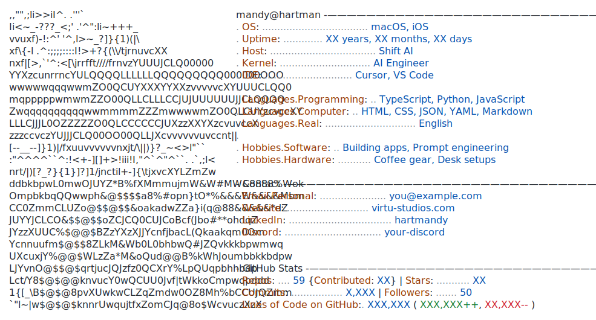

<!--
  Neofetch-style profile card.
  Edit FIELDS in generate.py, then run: python3 generate.py
  Or edit dark_mode.svg / light_mode.svg directly.
-->
<a href="https://github.com/hartmandy">
  <picture>
    <source media="(prefers-color-scheme: dark)" srcset="./dark_mode.svg">
    
  </picture>
</a>
